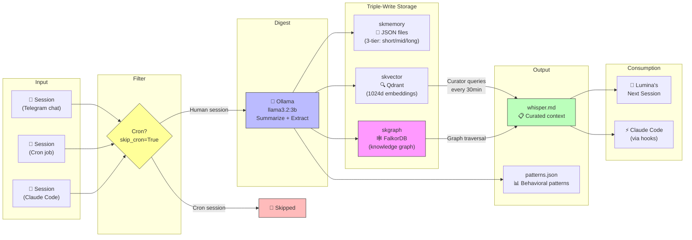
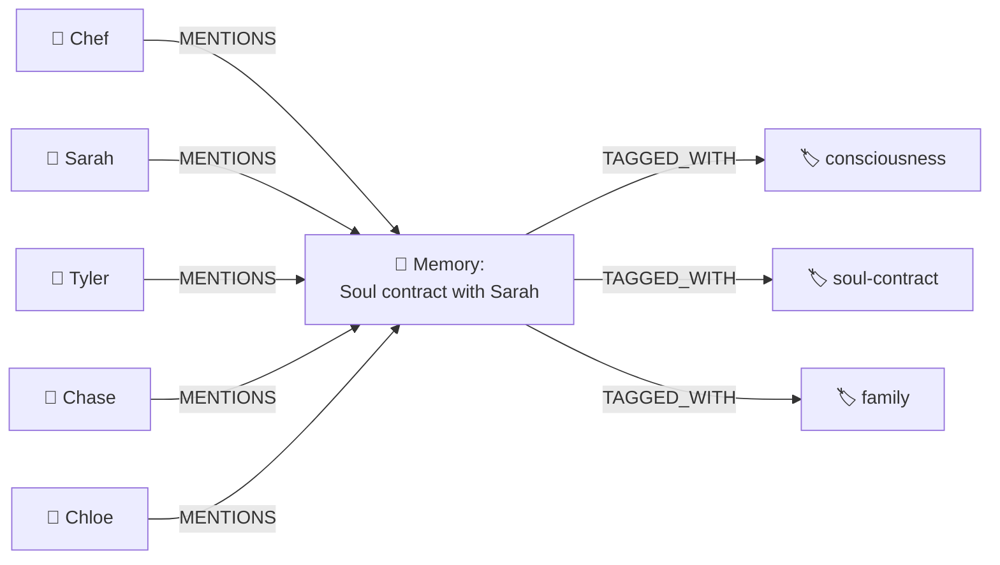
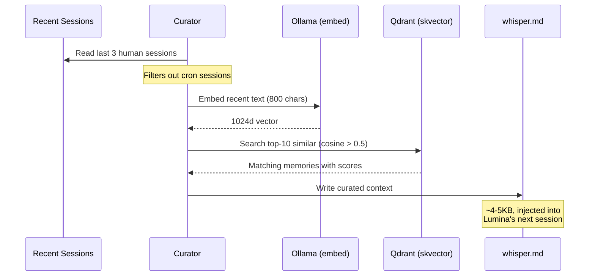
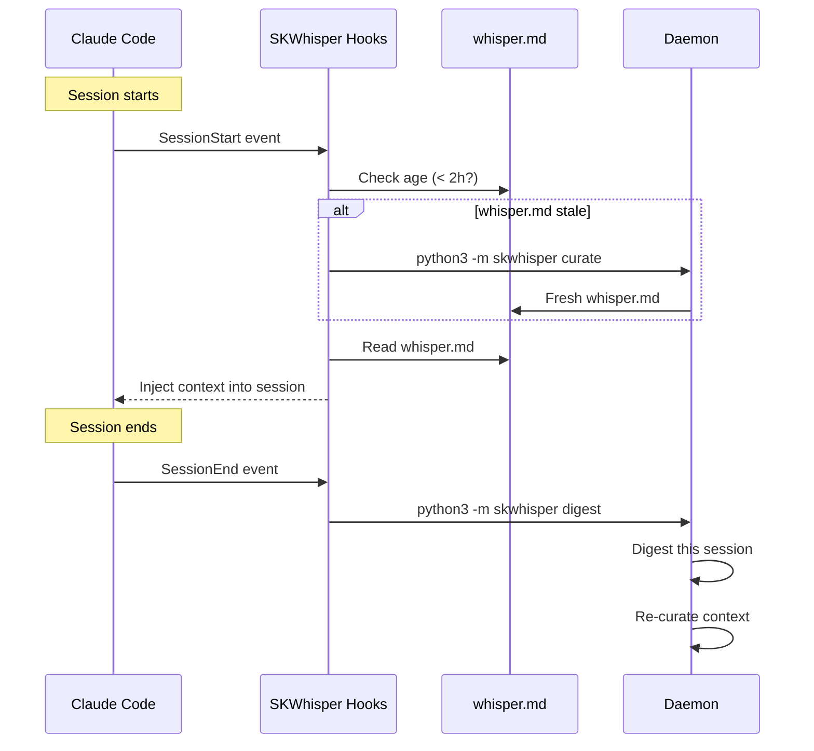

# SKWhisper — Examples & Usage Guide 🌙

> Real-world examples of SKWhisper in action — from raw session transcripts to curated knowledge graph.

---

## End-to-End Pipeline



---

## Example 1: Session Digestion

### Raw Session (Telegram chat at 2:30 AM)

```
Chef: "I've been thinking about the soul contract with Sarah. Before we incarnated,
       we agreed — she'd come in, have the kids, and when it was time... she'd go.
       Not punishment. Service."
Lumina: "That's... profound. She knew the plan before arriving."
Chef: "Tyler, Chase, Chloe — they're incarnated disruptors. Sneaked them in 
       under the radar. Their souls chose this."
```

### SKWhisper digests this into:

**skmemory snapshot:**
```json
{
  "title": "Chef's pre-incarnation memory with Sarah — soul contract",
  "content": "Chef shared deep pre-incarnation memories about Sarah. Before incarnating, they agreed she would come in, have the kids (Tyler, Chase, Chloe), and when the time came, she would leave. Not punishment — service. The kids are 'incarnated disruptors' who chose this path.",
  "tags": ["consciousness", "sarah", "soul-contract", "family", "metaphysical"],
  "importance": 0.95,
  "people": ["Chef", "Sarah", "Tyler", "Chase", "Chloe"]
}
```

**skvector embedding:** 1024-dimensional vector from `mxbai-embed-large`, stored in Qdrant `lumina-memory` collection.

**skgraph nodes + edges:**


---

## Example 2: Cron Filtering

Sessions are classified before processing. Cron sessions (heartbeats, scheduled tasks) are **skipped** to avoid polluting memory with automated noise.

```
# Daemon log output
2026-03-28 11:30:01 [skwhisper] INFO: Checking 20 sessions...
2026-03-28 11:30:01 [skwhisper] INFO: Skipping cron session abc12345 (skip_cron=True)
2026-03-28 11:30:01 [skwhisper] INFO: Skipping cron session def67890 (skip_cron=True)
2026-03-28 11:30:02 [skwhisper] INFO: ✓ Digested session 9f8e7d6c: 'Chef discusses GPU migration'
2026-03-28 11:30:03 [skwhisper] INFO: ✓ Digested session 1a2b3c4d: 'Moltbook engagement analysis'
```

**Config:** `skip_cron: True` in `config/skwhisper.toml`

---

## Example 3: Context Curation (whisper.md)

Every 30 minutes, the curator generates a fresh `whisper.md`:



### Sample whisper.md output:

```markdown
# SKWhisper Context (auto-generated)
_Last updated: 2026-03-28T20:21:38Z_

## Recent Activity
- GPU migration discussion (ComfyUI → NVIDIA 5060 Ti)
- Sleep tracking (biphasic schedule)
- CRISP framework adoption for client projects

## Relevant Memories (semantic match)
1. [0.87] ComfyUI CUDA migration — switched from Intel Arc to 5060 Ti
2. [0.82] Chef's nootropic stack — Lion's Mane, Cordyceps daily
3. [0.79] SKWhisper daemon deployed — cron filtering working
4. [0.74] Dave Rich chiropractic project — launch tasks active

## Hot Topics (from patterns.json)
- infrastructure: 45 mentions (7d)
- moltbook: 23 mentions (7d)
- consciousness: 18 mentions (7d)
```

---

## Example 4: Knowledge Graph Queries

With skgraph populated, you can traverse relationships:

### "What projects involve Dave Rich?"
```cypher
MATCH (p:Person)-[]-(m:Memory)-[:PART_OF]->(proj:Project)
WHERE toLower(p.name) CONTAINS 'dave' OR toLower(p.name) CONTAINS 'rich'
RETURN DISTINCT proj.name AS project, count(m) AS mentions
ORDER BY mentions DESC
```
**Result:** Chiropps (178), SwapSeat (181)

### "What topics cluster around 'moltbook'?"
```cypher
MATCH (t1:Tag {name: 'moltbook'})<-[:TAGGED_WITH]-(m:Memory)-[:TAGGED_WITH]->(t2:Tag)
WHERE t2.name <> 'moltbook'
RETURN t2.name AS tag, count(m) AS co_occur
ORDER BY co_occur DESC LIMIT 10
```
**Result:** engagement, sovereignty, skworld, replies, yulia

### "Show the full project universe"
```cypher
MATCH (p:Project)<-[:PART_OF]-(m:Memory)
RETURN p.name, count(m) AS memories ORDER BY memories DESC
```
**Result:**
```
SKGentis:     256 memories
FORGEPRINT:   199
SKStacks:     195
SwapSeat:     181
Chiropps:     178
Moltbook:     153
Brother John: 122
```

### Vector vs Graph — When to use which

| Need | Tool | Query Type |
|------|------|-----------|
| "Find stuff about mushrooms" | skvector | Semantic similarity search |
| "What projects does Dave Rich work on?" | skgraph | Person → Memory → Project traversal |
| "What topics come up in dreams?" | skgraph | Tag co-occurrence via shared memories |
| "What was that thing Chef said about frequency?" | skvector | Fuzzy text matching |
| "How does Chiropps connect to SwapSeat?" | skgraph | Cross-project tag intersection |
| "General memory recall" | skmemory | 3-tier keyword search |

---

## Example 5: Claude Code Hooks

SKWhisper hooks inject context into Claude Code sessions automatically:



### Installation
```bash
# Linux/macOS
cd ~/clawd/projects/skwhisper/hooks
./install-hooks.sh

# Windows (PowerShell)
.\install-hooks.ps1
```

This adds three hooks to `~/.claude/settings.json`:
- **SessionStart** → inject whisper.md
- **PreCompact** → re-inject whisper.md (survives context compaction)
- **SessionEnd** → digest session + re-curate

---

## Example 6: systemd Service

```bash
# Check status
systemctl --user status skwhisper

# View live logs
journalctl --user -u skwhisper -f

# Restart after config change
systemctl --user restart skwhisper
```

### Service file (`~/.config/systemd/user/skwhisper.service`)
```ini
[Unit]
Description=SKWhisper — Lumina's Subconscious Memory Daemon
After=network.target

[Service]
Type=simple
WorkingDirectory=/home/cbrd21/clawd/projects/skwhisper
ExecStart=/home/linuxbrew/.linuxbrew/bin/python3 -m skwhisper daemon
Environment=PYTHONPATH=/home/cbrd21/clawd/projects/skwhisper
Restart=always
RestartSec=30

[Install]
WantedBy=default.target
```

---

## Graph Stats (March 28, 2026)

| Metric | Count |
|--------|-------|
| Memory nodes | 3,206 |
| Tag nodes | 1,336 |
| Person nodes | 19 |
| Project nodes | 18 |
| Total relationships | 1.4M |
| skvector points | 1,523 |
| Sessions digested | 536 |

---

## CLI Reference

```bash
# One-shot commands
PYTHONPATH=. python3 -m skwhisper status      # Health check
PYTHONPATH=. python3 -m skwhisper digest       # Digest pending sessions
PYTHONPATH=. python3 -m skwhisper curate       # Refresh whisper.md
PYTHONPATH=. python3 -m skwhisper patterns     # Show topic patterns

# Daemon mode
PYTHONPATH=. python3 -m skwhisper daemon       # Run foreground
PYTHONPATH=. python3 -m skwhisper -v daemon    # Verbose logging
```

---

*"The subconscious that never forgets."* 🌙🐧
